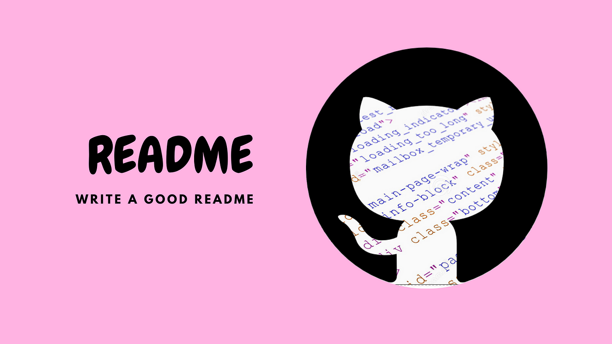

<p width="100%" align="center">
teste teste <br>
    
</p>

# Documentação do readme

<p id="descricao" align="justify">
 Este repositorio apresenta um readme padronizado.
 VocÊ irá ver a utilização de imagens com html e markdown.

 Iremos apresentar um menu como tabela de conteúdo,
 tecnologias, badges, etc.
 </p>

 [](https://github.com/) [](https://github.com) [](https://www.typescriptlang.org/)


## Menu

 <ul>
    <li><a href="#descricao">Descrição</a></li>
    <li><a href="#status">Status do projeto</a></li>
    <li><a href="#features">Features</a></li>
    <li><a href="#mapa">Mapa do projeto</a></li>
 </ul>

 ## :rocket: Status do projeto
 <p id="status">
    ...Em construção
 </p>

 <p id="features"></p>

 ## Features
 - [X] Badges
 - [X] Status
 - [ ] Tecnologias 
 
 <p id="mapa"></p>

 ## Mapa do projeto
 
 ```.
├───image
└───temp
```
